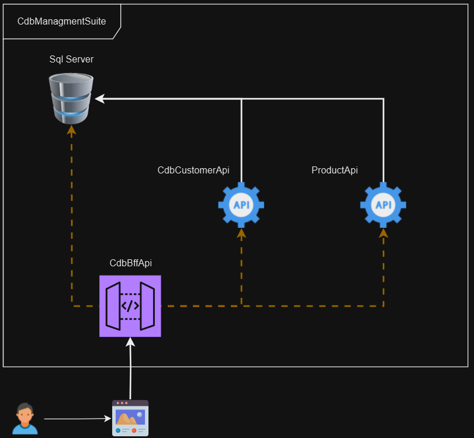

# Tech Challenge Bonus - CdbManagementSuite

# Introdução

O Tech Challenge Bonus desta fase será desenvolver um Backend for Frontend (BFF) utilizando a plataforma .Net 8 para o gerenciamento de CDBs, considerando a persistência de dados e a qualidade do software.

# Estudo de caso

O CdbManagementSuite é uma solução de software composta por três APIs projetadas para gerenciar Certificados de Depósito Bancário (CDBs) e clientes associados. Utilizando uma arquitetura BFF (Backend for Frontend), a solução visa fornecer o gerenciamento de produtos financeiros e informações de clientes, agregando dados e funcionalidades de múltiplas fontes.

# Domain StoryTelling

Para esclarecimento foi desenvolvido o domain storytelling. Esse vai ser o fluxo da solução.



# Requisitos Funcionais

- API de Produtos CDB (CdbProductApi)
- API de Cliente (CdbCustomerApi)
- BFF (Backend for Frontend) (CdbBffApi)

# Tecnologias Utilizadas:

- **.NET 8**: Framework para construção da Minimal API.
- **C#**: Linguagem de programação usada no desenvolvimento do projeto.
- **Entity Framework**: ORM (Object-Relational Mapping) utilizado para interagir com o banco de dados.
- **xUnit**: Framework de testes utilizado para realizar testes unitários.
- **SQL Server**: Banco de dados relacional usado para armazenar os dados da aplicação.

# Banco de Dados

Para persistência dos dados foi criado duas tabelas, a saber:

```sql
/*
Autor:Jefferson Santos

Data de Criação: 27/07/2024

Propósito:
Este script é destinado a simplificar o acesso a informações sobre produto e cliente.

*/

CREATE DATABASE DB_CDB_MANAGEMENT

USE DB_CDB_MANAGEMENT

-- Tabela para armazenar os produtos
CREATE TABLE Product (
    Id INT PRIMARY KEY IDENTITY(1,1),
    Name NVARCHAR(100) NOT NULL,
    Description NVARCHAR(255),
    Value DECIMAL(18, 2) NOT NULL,
    CreationDate DATETIME NOT NULL DEFAULT GETDATE(),
    ExpirationDate DATETIME NOT NULL,
    InterestRate DECIMAL(5, 2) NOT NULL,
    IsActive BIT NOT NULL DEFAULT 1
);

CREATE TABLE Client (
    Id INT PRIMARY KEY IDENTITY(1,1),
    FirstName NVARCHAR(100) NOT NULL,
    LastName NVARCHAR(100) NOT NULL,
    Email NVARCHAR(255) NOT NULL UNIQUE,
    BirthDate DATE NOT NULL,
    CreationDate DATETIME NOT NULL DEFAULT GETDATE(),
    IsActive BIT NOT NULL DEFAULT 1
);

CREATE TABLE ProductClient (
    Id INT IDENTITY(1,1) PRIMARY KEY,
    ProductId INT NOT NULL,
    ClientId INT NOT NULL,
    PurchaseDate DATETIME NOT NULL DEFAULT GETDATE(),
    PurchaseValue DECIMAL(18, 2) NOT NULL,
    FOREIGN KEY (ProductId) REFERENCES Product(Id) ON DELETE CASCADE,
    FOREIGN KEY (ClientId) REFERENCES Client(Id) ON DELETE CASCADE
);
```

Este comando cria uma nova migração baseada nas alterações feitas no modelo de dados.

```
Add-Migration NomeDaMigracao
```

Este comando aplica todas as migrações pendentes ao banco de dados.

```
Update-Database
```

# Documentação

- [Documentação da API](https://horse-neon-79c.notion.site/Documenta-o-da-API-04183b890d7c47cb89af4445d01d6678?pvs=4)
- [Documentação de Estilo para C#](https://horse-neon-79c.notion.site/Documenta-o-de-Estilo-para-C-de62b229fd01436a96f7a090b4d11e27?pvs=4)
- [Documentação dos Testes](https://horse-neon-79c.notion.site/Documenta-o-dos-Testes-a402a32a16a24b1b925dab83201e7d19?pvs=4)
- [Documentação de Banco de Dados](https://horse-neon-79c.notion.site/Documenta-o-de-Banco-de-Dados-6ba60c4c8533491a9d28da71f6b57c93?pvs=4)
- [Guia de Estrutura do Projeto](https://horse-neon-79c.notion.site/Guia-de-Estrutura-do-Projeto-fbfbc24c616d456bb56306cfda2c0bc9?pvs=4)

# **Checklist de Conclusão de Tarefas**

- [x]  Manter Cliente.
- [x]  Manter Produto.
- [x]  Requisições com Refit.
- [x]  Requisições com HttpClientFactory.
- [x]  Persistência com Dapper.
